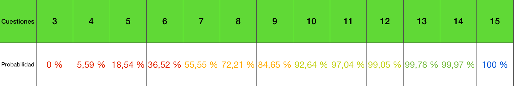

# Probabilidad Cuestiones
Calculadora de probabilidad de poder responder las 4 cuestiones en función del nº que te hayas estudiado

En el examen de selectividad de historia de la Comunidad de Madrid (modelo COVID), te ofrecen 12 cuestiones de las 23 que hay, y de las cuales tienes que responder 4.

\h1 Tabla de datos:
Parametros por defecto (Examen de la Comunidad de Madrid)

Si sabes menos de 3 no puedes responder 4, lógicamente, y por eso es 0%.
Si sabes más de 15, entonces te quedan sin saber 8, aunque tengas la mala suerte de que te entren esas 8 en el examen, quedarán 4 que sí sepas, por eso es 100%.

\h1 Disclaimer Importante
En este caso estamos asumiendo que todas las cuestiones son igual de probables (caso ideal), pero en la realidad NO ES ASÍ, ya que las cuestiones aparecen repartidas en bloques, por ejemplo, si te estudias el bloque 3 entero (9 cuestiones), es improbable que aparezcan varias de ellas juntas (en EvAU no van a ir a preguntar por un tema solo), lo mejor sería repartirlas en función de lo que hayan preguntado otros años. 

Independientemente, he hecho este proyecto por diversión, tú estudia con cabeza, lo mejor es que vayas al menos a por 15 cuestiones para asegurar el 100%, que luego vienen los lloros.
